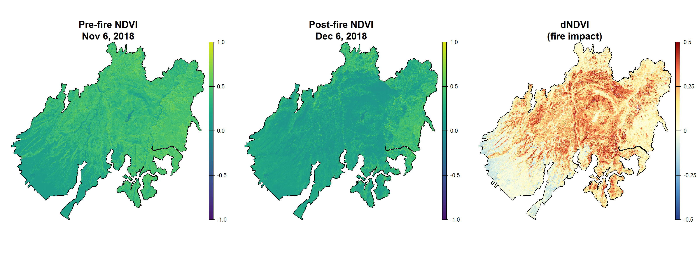
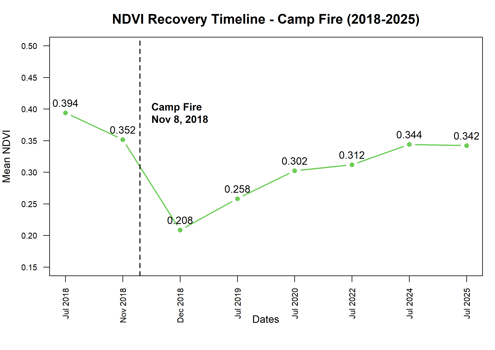
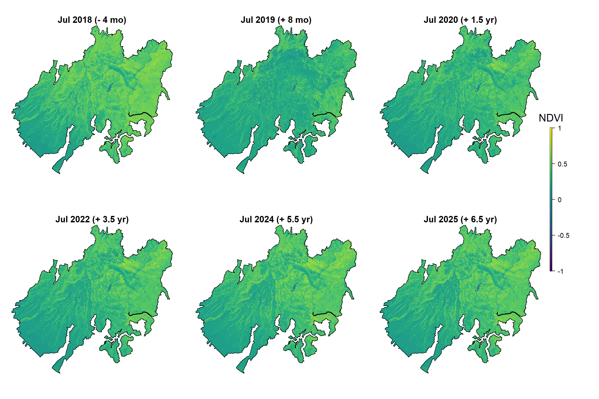
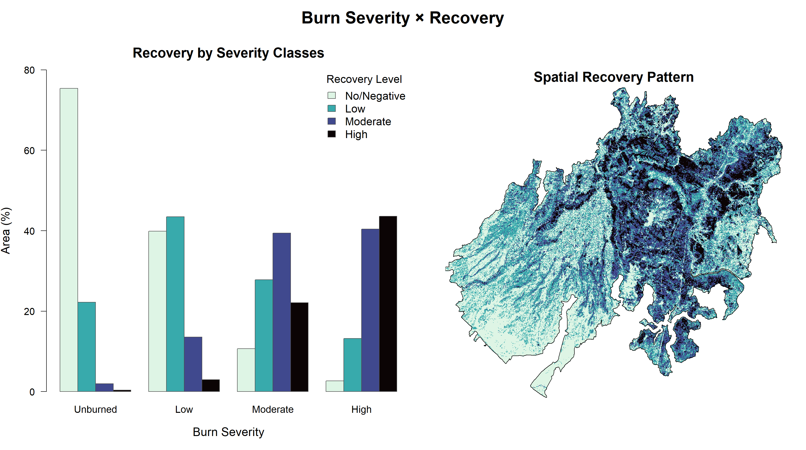
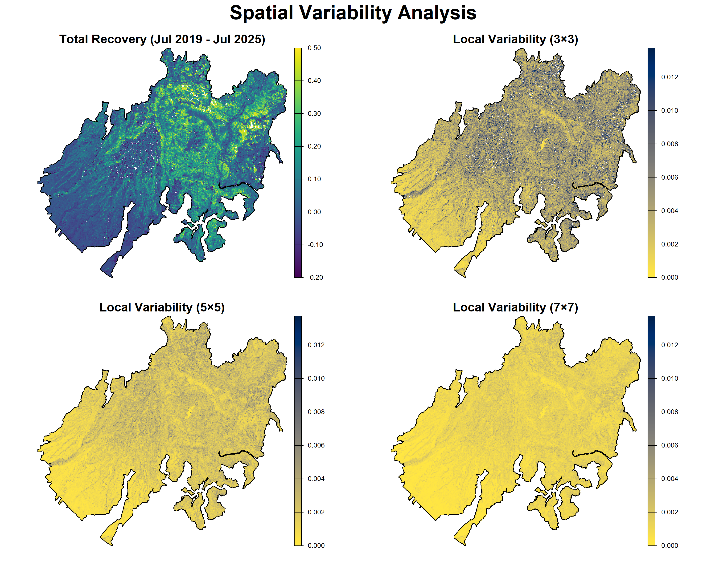

> #### Serena Casagrande
>
> ##### Matriculation n. 0001138070
> 
# <h1 align="center">Camp Fire Reforestation Analysis — Paradise, CA (2018–2025)</h1>

---

## Introduction
The remote sensing project "Camp Fire Reforestation Analysis" employed **Sentinel-2** multitemporal imagery to analyze **vegetation loss and recovery** following the **Camp Fire** (November 8, 2018) in Paradise (Butte county), described as the deadliest and most destructive wildfire in California history.

<p align="center">
  
</p>
<p align="center"><em>Camp Fire 2018 – Credit: NASA</em></p>

---

### Study Area

From November 8, 2018, over 17 days, the Camp Fire burned more than **153,000 acres (619.2 km²)**, killed 85 people, and destroyed over 18,000 structures in Butte County, California, devastating the town of Paradise.

Following the fire, starting in spring 2020 several projects of reforestation started in certain regions of the area affected by the fire. An example of such project is the one managed by The Bureau of Land Management (BLM) which, in sync with the American Forests, designed and carried out the reforestation project in three main parcels.

---

### Aim of the Study

This analysis investigated the post-fire vegetation recovery (in the form of NDVI changes) in the Camp Fire area, from **July 2018 (pre-fire condition)** until **July 2025 (6.5 years post-fire)**, the latest peak growing season available (determining the current condition).

The **objectives of the study** were:

1.  Quantifying the immediate vegetation loss from the fire (December 2018)
2.  Map post-fire NDVI recovery trajectory over 6.5 years
3.  Assess the relationship between burn severity registered and vegetation regrowth in the following years
4.  Investigate the spatial heterogeneity in recovery patterns (2019-2025)

<p align="center">
  
</p>
<p align="center"><em>RGB plotting and Fire perimeter (red)</em></p>

---

## Data and Methods

### Sentinel-2 Imagery

Eight cloud-free Sentinel-2 L2A images were selected and downloaded from the [Copernicus Browser](https://browser.dataspace.copernicus.eu/), covering specific dates in fire and recovery timeline:

| Date          | Role                                                      |
|-------------------------|-----------------------------------------------|
| July 2018     | Pre-fire baseline (last peak growing season before fire ) |
| November 2018 | Immediate pre-fire (2 days before)                        |
| December 2018 | Immediate post-fire                                       |
| July 2019     | First post-fire growing season (+8 months)                |
| July 2020     | Early recovery (+1.5 years)                               |
| July 2022     | Mid-term recovery (+3.5 years)                            |
| July 2024     | Late recovery (+5.5 years)                                |
| July 2025     | Current condition (+6.5 years)                            |

Each date consisted of two Sentinel-2 tiles (north and south) to cover the whole area of interest.

While loading the 10m resolution bands (bands B02, B03, B04, B08), the tiles were also cropped to the fire bounding box and merged before further analysis. The operation was performed using two functions created with the purpose to lighten the computational work.

```{r}
s2_bands <- function(folder_name) {
  all_files <- list.files(folder_name, pattern = "\\.jp2$", recursive = TRUE, full.names = TRUE)
  band_files <- all_files[grep("B0[2348]_10m\\.jp2$", all_files)]
  rast(sort(band_files)) 
}

merge_and_crop <- function(tile_north, tile_south, bbox) {
  mosaic(crop(tile_north, bbox), crop(tile_south, bbox), fun = "mean")
}
```

---

### R Packages used

``` r
library(terra)      # Spatial data analysis package
library(viridis)    # Color-blind friendly color palettes
library(fields)     # Spatial statistics and custom legend creation
library (imageRy)   # For satellite image processing
```

---

### Fire Perimeter

The fire perimeter shapefile was downloaded from the [MTBS](https://www.mtbs.gov/) (Monitoring Trends in Burn Severity) database and reprojected to match Sentinel-2 imagery (EPSG:32610, UTM Zone 10N).

All analyses were conducted within the **burn perimeter** to focus the study specifically on the affected area.

---
### NDVI Calculation

The Normalized Difference Vegetation Index was computed for all eight dates applying the created formula to simplify the process:

``` r
calc_ndvi <- function(img) { 
  (img[[4]] - img[[3]]) / (img[[4]] + img[[3]]) 
}
```

where **img[[4]]** = NIR = Band 8 (842 nm) and **img[[3]]** = Red = Band 4 (665 nm).

``` r
#### ----- NDVI CALCULATION ----- 
ndvi.july.2018 <- calc_ndvi(july.18.10m_fire)
ndvi.nov.2018 <- calc_ndvi(nov.18.10m_fire)
ndvi.dec.2018 <- calc_ndvi(dec.18.10m_fire)
ndvi.july.2019 <- calc_ndvi(july.19.10m_fire)
ndvi.july.2020 <- calc_ndvi(july.20.10m_fire)
ndvi.july.2022 <- calc_ndvi(july.22.10m_fire)
ndvi.july.2024 <- calc_ndvi(july.24.10m_fire)
ndvi.july.2025 <- calc_ndvi(july.25.10m_fire)
```

---

## Results

### Fire Impact Assessment

The Burn severity was assessed through the calculation of the **dNDVI** (difference NDVI), determined as pre-fire NDVI (Nov 6, 2018) minus post-fire NDVI (Dec 6, 2018) NDVI. In this way, positive values indicate vegetation loss, while negative values indicate vegetation increase.

**Mean dNDVI: 0.143**.

<p align="center">
  
</p>
<p align="center"><em>Camp Fire NDVI loss</em></p>

The Viridis palette was used to plot the pre- and post-fire NDVIs.

To visualize dNDVI, a divergent **dark red–light yellow–blue** color palette was created using the `colorRampPalette()` function. This palette highlights **severely burned areas** in *red* and **unaffected or weakly affected areas** in *blue*, while remaining suitable for colorblind-friendly visualization.

To enhance contrast where most values occur, the palette range was limited to **[-0.5, 0.5]**, which contains the majority of observed dNDVI values. This approach avoids the compression of palette caused by extreme values.

---

### Recovery Rates and Timeline

The investigation of mean NDVI values across the entire timeline shows a clear recovery trajectory, especially in the first two years after the fire, even though vegetation productivity remains below pre-fire levels after 6.5 years.

| Date | Mean NDVI | ΔNDVI from Pre-fire Baseline | Recovery rate (ΔNDVI/yr)\* | Notes |
|:--------------:|:---------------:|:------------------------:|:-----------------------:|:------------------------------------:|
| Jul 2018 | 0.394 | — | — | Pre-fire baseline |
| Nov 2018 | 0.352 | -10.8% | — | Natural autumn decline |
| **Dec 2018** | **0.208** | **-47.1%** | **—** | **Maximum fire impact** |
| Jul 2019 | 0.258 | -34.5% | +0.074/yr | First growing season |
| Jul 2020 | 0.302 | -23.2% | +0.044/yr | Early recovery |
| Jul 2022 | 0.312 | -20.9% | +0.005/yr | Mid-term recovery |
| Jul 2024 | 0.344 | -12.7% | +0.016/yr | Late recovery |
| **Jul 2025** | **0.342** | **-13.2%** | **-0.002/yr** | **Current condition** |

*NDVI values Timeline*

\*Recovery rate = ΔNDVI per year between consecutive measurements

The Fire caused a 47.1% (0.394 → 0.208) NDVI loss compared to the pre-fire baseline (July 2018) and a net 36.3% loss compared to Nov 2018 vegetation condition.

During the next 1.5 years, vegetation experienced the fastest NDVI increase of the entire study period, with recovery rates equivalent to \~0.074/yr initially and \~0.044/yr in the following year. This rapid recovery mainly reflects shrubland regrowth rather than mature forest recovery.

<p align="center">
  
</p>
<p align="center"><em>NDVI Recovery trajectory</em></p>


By July 2025, 64% of lost NDVI was restored (+0.134 NDVI from the maximum fire impact). The remaining 13% deficit likely reflects an ongoing vegetation-type transitions after the initial fast regrowth. This transition is also, most likely the cause of the plateau-like effect of NDVI between July 2024 and July 2025. Other causes may be associated with the occurrence of adverse climatic conditions or the presence of stress factors for the recovering vegetation.

---

### Temporal NDVI Maps

Spatial NDVI maps for each July date (same peak season) illustrate progressive greening of the burn area over the years. Recovery appears heterogeneous, possibly linked to the land topography and altitude, determining differences in the recovery rates in valley bottoms compared to ridgetops and south-facing slopes.

<p align="center">
  
</p>
<p align="center"><em>Temporal NDVI Maps</em></p>


---

### Burn Severity × Recovery Analysis

The relationship between fire damage and subsequent observed recovery was investigated by classifying both **dNDVI** (severity) and **total recovery**, defined as the NDVI July 2025 minus the July 2019, into four categories. The total recovery was computed using July 2019 NDVI in order to minimize seasonal (phenological) effects.

The categorization was based on quantile distribution of the two:

**Severity classes** (dNDVI):

-   Unburned (\< 0)
-   Low (0–0.15)
-   Moderate (0.15–0.35)
-   High (\> 0.35)

**Recovery classes** (ΔNDVI):

-   No/Negative (\< 0)
-   Low (0–0.1)
-   Moderate (0.1–0.25)
-   High (\> 0.25)

The relationship between burn severity and recovery was also investigated using the **Spearman** correlation test, after the transformation in continuous values.

```{r}
# Correlation test using the Spearman method
sev_cont <- values(dNDVI.18, na.rm = TRUE)
rec_cont <- values(total_recovery, na.rm = TRUE)
cor_test <- cor.test(sev_cont, rec_cont, method = "spearman", exact = FALSE)

cor_test$estimate
cor_test$p.value
```

**Spearman rank correlation** results: **ρ = 0.669, p value \< 0.001**

The correlation results show a strong positive relationship between burn severity and vegetation recovery, indicating that more severely burned areas experienced larger NDVI increases over time.

This strong positive relationship can be visually appreciated in the barplot representation, where burn severity and recovery categories were plotted together. It is possible to see how the percentage of moderate-high recovery categories increases with the increase of the burn severity level, the opposite is shown by the "no-recovery" column.

<p align="center">
  
</p>
<p align="center"><em>Severity x Recovery Relationship</em></p>

---

### Spatial Variability

The spatial heterogeneity of the total recovery period (July 2019- July 2025) was also quantified using uniform **focal standard deviation** at three spatial scales, 3×3, 5×5, and 7×7 pixel windows (corresponding to 30m, 50m, and 70m for Sentinel-2 imagery).

Total recovery was plotted using the viridis palette, while focal variability maps used the inverted cividis palette. The color scale was limited to the 99th percentile (0.014) to improve contrast and avoid palette distortion from extreme values.

The 3×3 window highlights finer-scale variability but also introduces higher local noise, while 5×5 and 7×7 focal windows focus on broader recovery patterns. The similarity between the latter indicates that recovery variability mainly occurs at spatial scales larger than 50-70 m, so increasing the focal window mainly produces additional smoothing rather than new spatial information.

<p align="center">
  
</p>
<p align="center"><em>Spatial Variability</em></p>

---

## Discussion

### Incomplete Recovery

After 6.5 years, mean NDVI remains 13% below pre-fire baseline (0.342 vs 0.394). This is mostly to be attributed to the time needed by vegetation to reach a mature status, which is a typically slow process that will require decades to reach pre-fire canopy structure.

There is also the phenomenon of vegetation-type transitions, both from before to after the fire, and also during the whole period of regrowth, as types of vegetation convert naturally to a new vegetative equilibrium as the time goes by.

### Severity-Recovery Relationship

The positive correlation (ρ = 0.669) between burn severity and recovery is ecologically meaningful:

-   **High-severity burns** create canopy openings → rapid resprouting (oaks, shrubs) → this leads to high NDVI recovery
-   **Low-severity burns** leave stressed trees → slow development → lower NDVI recovery
-   **Not-affected areas** will show no recovery, since no NDVI was lost in the first place

It is important to notice that High recovery ≠ "forest recovery". The registered initial fast recovery mainly represents **shrubland/oak woodland establishment**, and only later the forest recovery will develop and become predominant.

---

## Conclusions

-   The Camp Fire caused severe NDVI decline across the 153,000-acre burn perimeter (mean dNDVI = 0.143, representing 47% vegetation loss)
-   By July 2025 (+6.5 years), **\~64% of lost productivity has been restored**, but mean NDVI remains 13% below pre-fire levels
-   **Positive correlation** between burn severity and recovery (ρ = 0.669, p \< 0.001), driven by rapid resprouting in severely burned areas
-   Recovery is **spatially heterogeneous**, particularly visible at finer spatial scales (3×3), reflecting differences in burn severity and local environmental conditions.
-   Overall, Sentinel-2 imagery and R provide effective tools for monitoring post-fire vegetation dynamics over time.

---

## References

-   **BLM Camp Fire Reforestation Plan** (2021): Climate-informed restoration strategies for Butte County, CA. [Link](https://www.blm.gov/sites/default/files/docs/2021-09/BLM_CampPlan.pdf)
-   **Monitoring Trends in Burn Severity (MTBS)**: <https://www.mtbs.gov/>
-   **Copernicus Browser (Sentinel-2)**: <https://browser.dataspace.copernicus.eu/>


